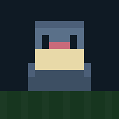
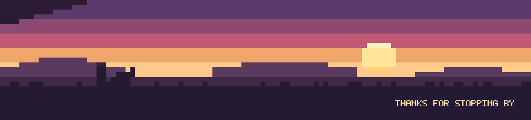

<!--
  Profile README for github.com/ChhabhayaManan
  Art:   node scripts/gen-art.mjs   -> assets/*.svg
  Board: node scripts/snake.mjs     -> output branch (see .github/workflows/snake.yml)
  Dark theme only, by design. Every asset is drawn to read on #0d1117.
-->

  

Cloud and backend engineer working mostly in **Python** and **C++**. Currently building LLM systems with LangChain and LangGraph, and the AWS + Terraform plumbing that keeps them running.

Mostly interested in the boring parts — reproducible infra, observable pipelines, and tests that actually catch things.

 

<!-- PLACEHOLDER: swap in the real repos. Keep the shape: link, what it is, what's hard. -->

**[repo-name-here](https://github.com/ChhabhayaManan)** — _placeholder_ 
LangGraph agents with a real deploy story: versioned graphs, replayable runs. 
Hard part: making non-determinism debuggable.

**[repo-name-here](https://github.com/ChhabhayaManan)** — _placeholder_ 
Opinionated Terraform modules for small AWS accounts that still pass an audit. 
Hard part: sane defaults without hidden magic.

  

Regenerated every 6 hours from the live contribution calendar. The body grows one segment per cell eaten and never shrinks, so it ends the loop as long as the year was busy. · <a href="https://chhabhayamanan.github.io/ChhabhayaManan/">Watch it frame by frame →</a>

  

