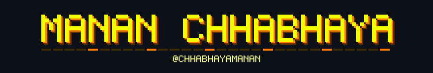
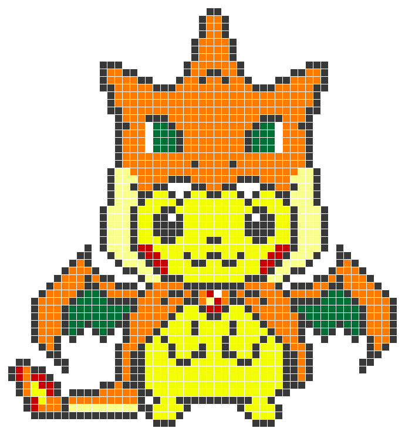

<!--
  Profile README for github.com/ChhabhayaManan
  Wordmark: node scripts/gen-art.mjs  -> assets/banner.svg
  Board:    node scripts/snake.mjs    -> output branch (see .github/workflows/snake.yml)
  Dark theme only, by design. Every asset is drawn to read on #0d1117.
-->

<!-- Header banner parked while the wordmark is being reworked. Re-enable by
     uncommenting; assets/banner.svg is still generated by scripts/gen-art.mjs.

  

-->

### Who am I

Cloud and backend engineer working mostly in **Python** and **C++**. Currently building LLM systems with LangChain and LangGraph, and the AWS + Terraform plumbing that keeps them running.

Mostly interested in the boring parts — reproducible infra, observable pipelines, and tests that actually catch things.

 

### Skills

<!-- Icons: github.com/marwin1991/profile-technology-icons — keep these on ONE line. A blank line or a lone &nbsp; between them puts each icon in its own 
, and every icon lands on its own row. -->

&nbsp;&nbsp;&nbsp;&nbsp;&nbsp;&nbsp;&nbsp;&nbsp;&nbsp;&nbsp;&nbsp;&nbsp;&nbsp;&nbsp;&nbsp;&nbsp;

### Next up

**[DevilOps](https://github.com/ChhabhayaManan/DevilOps)** — _ideation_ 
A Zapier for DevOps: build AI workflows that wire your pipelines, cloud and alerting together instead of gluing them by hand. 
Hard part: making an automation you can trust to touch production.

### Contribution heatmap

  

Rebuilt every 6 hours from live contributions. · <a href="https://chhabhayamanan.github.io/ChhabhayaManan/">Frame by frame →</a>

### Say hi

  

